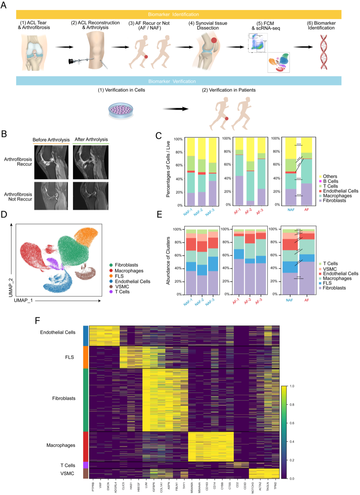

# Knee-Arthrofibrosis
This project used single-cell RNA sequencing technology to analyze synovial tissues from patients with recurrent knee hyperplasia and patients with curative knee hyperplasia, and identified key cell types and potential biomarkers of recurrent knee hyperplasia.

## method
1. Collection of synovial tissue samples from clinical patients
2. Digest tissue into single cell suspension for flow cytometric analysis
3. Analysis of gene expression profiles in individual cell types using single-cell RNA-sequencing
4. Bioinformatics analysis was used to compare the differences between the two groups of patients and identify potential biomarkers

## Result
1. 6 major cell types identified in single-cell RNA sequencing
2. Increased numbers of fibroblasts and macrophages were found in the hyperplastic group
3. Fibroblasts were divided into 3 subpopulations, among which DPP4+ fibroblasts and TNC+ fibroblasts were associated with proliferation
4. Divide macrophages into 3 subpopulations, in which Macro3 interacts with fibroblasts enhanced
5. Discovery of TGF-β-induced CCN2 may be a key biomarker for recurrent joint hyperplasia

## Conclusion
This study utilizing single-cell transcriptome analysis of human recurrent knee hyperplasia proposes CCN2 as a potential biomarker. This provides clues for subsequent prognostic evaluation and therapeutic target research.

## Reference
For specific reference information, see the original document

### Welcome to contribute to this project by submitting Issue and Pull Request
